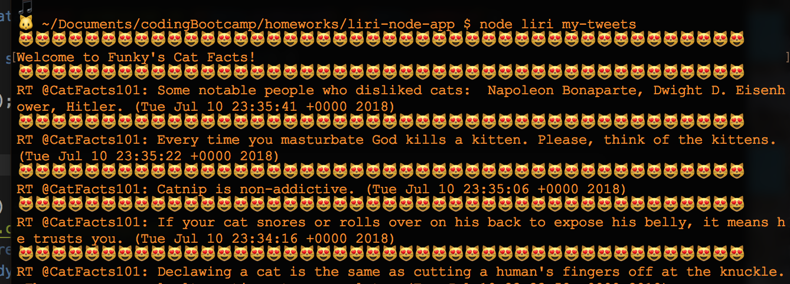
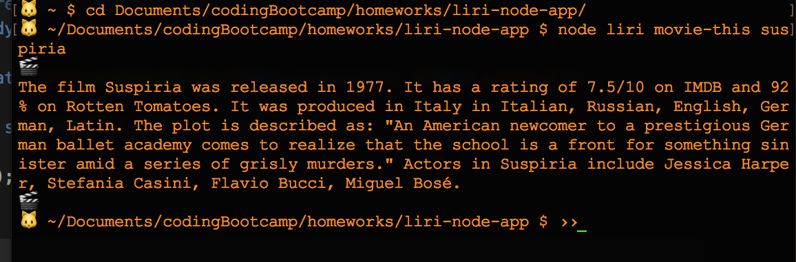
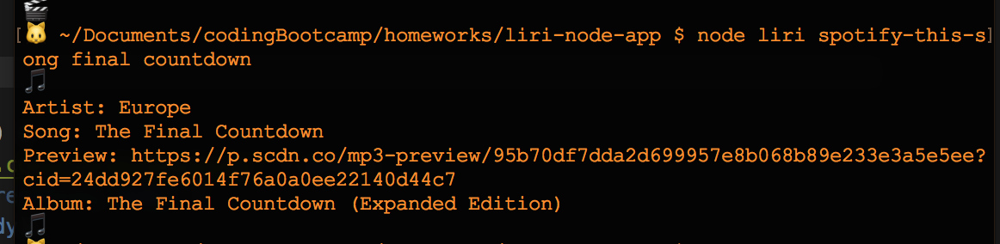
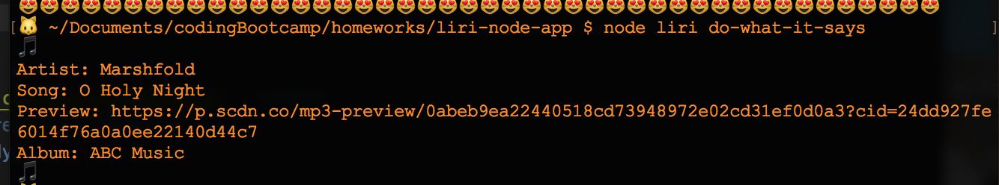

# LIRI

### Description

LIRI is a language interpretation and recognition interface. LIRI will display Funky's Cat Facts tweets, Spotify information for a song of your choice, or OMDB information for a movie of your choice.

### How to Use

1. create a .env file in the root directory and provide your Twitter and Spotify keys in the following format:
* SPOTIFY_ID=
* SPOTIFY_SECRET=
* TWITTER_CONSUMER_KEY=
* TWITTER_CONSUMER_SECRET=
* TWITTER_ACCESS_TOKEN_KEY=
* TWITTER_ACCESS_TOKEN_SECRET=

2. give LIRI a command on the command line in the format: 
* node liri < command > [< search >]

### Commands

* my-tweets: Does not take a search parameter. Will return the last 20 tweets from Funky's Cat Facts. Remember to check back often for more awesome cat facts!

* movie-this: Takes a movie title as a search parameter, otherwise will return one of the greatest films ever made. The movie title can be surrounded with quotes but does not need to be.

* spotify-this-song: Takes a song title as a search parameter. Not providing one will put you on the highway to the danger zone. The song title can be surrounded with quotes but does not need to be.

* do-what-it-says: Does not take a search parameter. Will use the command and search parameter specified in random.txt. The command and search parameter in random.txt should be separated by a comma. The search parameter can be surrounded with quotes but does not need to be.

    

